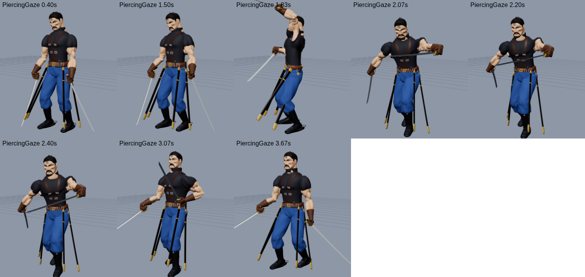
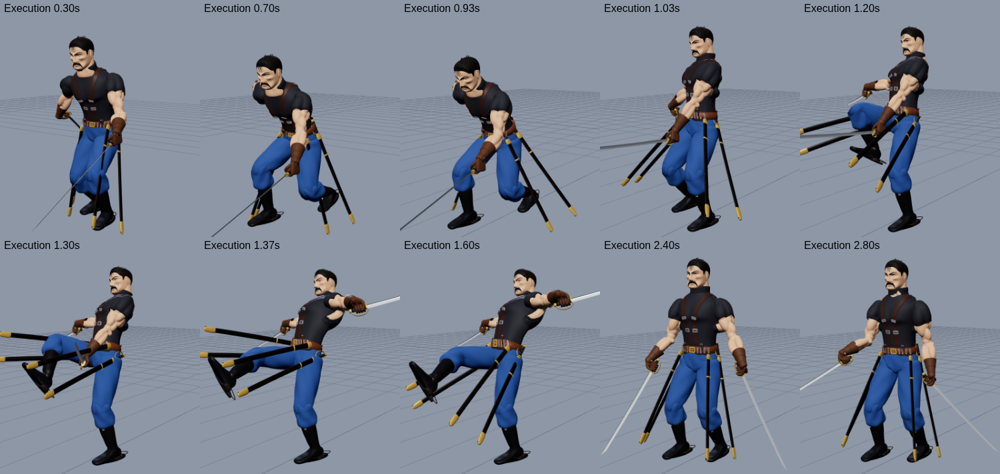
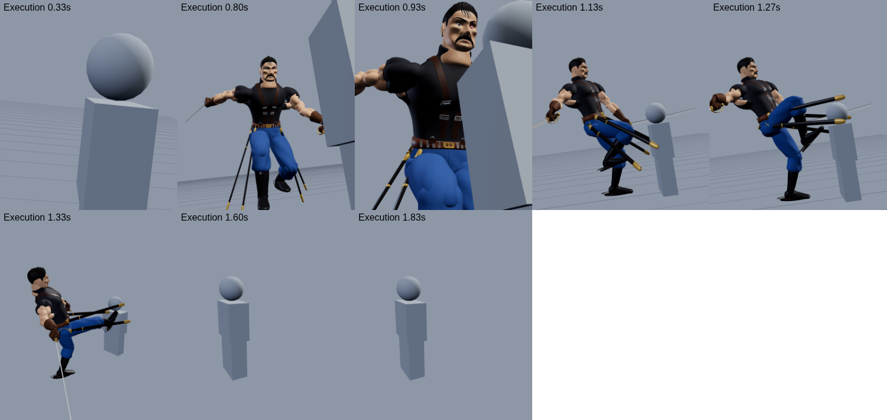

# King Bradley (Wrath): Roblox boss

A boss fight for Roblox featuring Führer King Bradley from *Fullmetal Alchemist: Brotherhood*. It
is structured like the Gluttony boss: one Model containing a Config module, a server brain and a
client animator. On top of that it adds:

* a shared `Motion` module for smooth dashes and leaps;
* a `Poses` module holding the key poses;
* an `Animator` engine that drives the bones of the skinned mesh.

The model is an improved version of the premade Bradley design:

* realistic, muscular shoulders and arms (deltoids, biceps, triceps, forearms) under the shirt;
* a properly fitted sleeve with a ribbed cuff;
* new skin tones;
* a full 49-bone skeleton with smooth skin weights, so the body bends like a person instead of
  rigid blocks.

| | | | |
|---|---|---|---|
|  |  |  |  |

## Files

| File | What it is |
|---|---|
| `model/KingBradley.fbx` | The rigged character: about 245k triangles in skinned MeshParts (each under the 20k-per-mesh limit, at most 4 bone influences per vertex) and a 49-bone armature. **Import this into Studio.** |
| `model/KingBradley.glb` | The same model as glTF, for Blender or other tools |
| `model/rig.json` | Bone list and rest positions (used by the offline test tools) |
| `KingBradleyScripts.rbxmx` | Folder with the 6 scripts: `Config`, `Motion`, `Poses`, `Animator`, `BossServer`, `BossClient` |

## Install

1. **Import the model.** In Roblox Studio, open **File → Import 3D** and pick
   `model/KingBradley.fbx`. In the import window:
   * keep **Rig Type: Custom** (never "No Rig");
   * leave **Merge Meshes** off;
   * keep **Scale Unit: Studs**;
   * optionally tick **Keep Zero Influence Bones** (if you don't, the scripts rebuild the three
     bones the importer drops).

   You get a Model with MeshParts and `Bone` objects (`B_Hips`, `B_Chest`, …). In edit mode he
   hangs wherever the importer dropped him, often in mid-air. That's normal: when the game starts,
   the server scales him to 9 studs and stands him on the floor below him.
2. **Insert the scripts.** Right-click **Workspace → Insert from File…** and pick
   `KingBradleyScripts.rbxmx`. You don't need to move anything. When the game starts, the scripts
   find the imported model by themselves (the Model holding the `B_Hips` bone) and move into it.
   If you placed scripts from an older version inside him, they are replaced automatically.
3. **Place him.** Move him above the spot where the fight should happen (any height) and turn him
   to face where he should stand guard. That spot is his home: he returns there and resets when
   players flee past `LeashRange`.
4. **Press Play (F5)**, not Run (F8). Run has no player, so nothing animates. The Output window
   (View → Output) should show:
   ```
   [Bradley] ready: Workspace.KingBradley, 69 meshes (69 skinned), 49 bones, 9.0 studs tall, hip height 4.0
   ```
   If it shows a `[Bradley] SETUP PROBLEM` line instead, that line says exactly what to fix.

Keep only one imported copy of him in the Workspace: delete failed imports. The scripts also
work when the folder is in ServerScriptService, and the boss is never streamed out in places
with StreamingEnabled.

### Colours

Every mesh name ends with its material, for example `Body_Skin`, `Shirt_Shirt` or
`Cape_CoatBlue`. `Config.Colors` maps those names to `{ r, g, b, material?, reflectance? }`, so
skin, uniform, cape and steel can be retuned from one table without touching the meshes.

## The fight

The design draws on what Bradley does in the anime:

* he fights with several sabers at once and draws fresh ones from his belt;
* he hurls sabers;
* he cuts through tanks and the soldiers on them during the Promised Day;
* the Ultimate Eye lets him see and predict every movement around him.

### Phase 1: the Führer (100% → 50%)

On first sight he **levels a saber at your throat** (Challenge) while his cape stirs.

| Move | What happens |
|---|---|
| **Lunge** (iaido dash) | Crouches with the right blade drawn back, then crosses up to 32 studs in a blink and cuts everyone on the line |
| **Cross Cut** | Right diagonal, left diagonal, then both blades in an **X**. He steps in with every cut. |
| **Saber Throw** | Hurls the left saber like a javelin, then draws a spare |
| **Tank Cleaver** | Leaps high and splits the ground with both blades: an impact circle, a 30-stud fissure and knockback |

At **80% health** he takes off the cape:

1. His left hand grabs the cape at the right shoulder.
2. He **rips it off** and **flings it away**.
3. The cape keeps falling as cloth and lands crumpled.

### Phase 2: the Ultimate Eye (50% → 0%)

He **tears off the eyepatch**:

1. His left hand reaches up and grips the patch.
2. He tears it away and flicks it aside.
3. His head bows, then rises.
4. Red light streams into the closed eye, lightning snaps up from the ground and the screen pulses
   like a heartbeat.
5. The Ouroboros eye opens:
   * the Ouroboros sigil spreads on the ground under him;
   * a pillar of red light shoots up and a dome of force bursts out;
   * lightning radiates off him and rocks lift off the floor.

**Piercing Gaze (once per fight, straight after the eye opens).**

1. The camera cuts to an extreme close-up of the Ultimate Eye for every player nearby.
2. A red sight line from his eye follows one player while he winds up a javelin throw.
3. The line **locks and turns white**, and he hurls the saber down it, straight at their chest.
4. It doesn't home in, so **step off the line to dodge it**.

If it hits, that player gets the **Execution cutscene**:

1. A close-up of the blade through their chest.
2. A low shot of him blitzing in.
3. His hand closing on the hilt.
4. A front kick that rips the blade out and sends them flying, with an impact frame.
5. The camera rides alongside their flight, then hands control back.

Everyone else sees it play out in the arena.

From then on:

* every basic attack plays **1.4× faster**, with shorter cooldowns;
* he sprints faster;
* he unlocks two eye abilities:

| Ability | What happens |
|---|---|
| **Thousand Cuts** | The eye locks on and time seems to stop. He then cuts **three times faster**: 12 slashes in 1.5 s while advancing, with afterimages. It ends in a **cross-shaped slash wave** that tears 80 studs down the arena. |
| **Phantom Step** | He reads where you are going and dashes a **pentagram of five cuts** through that spot, inside a transmutation circle. The cuts hang in the air while he stands with his back turned, then **all detonate at once**. Get out of the lines! |

**The Ultimate Eye form looks different.**

* **On him:** a smouldering crimson aura and embers, red lightning crawling over him, a burning
  star on the eye, red ripples where he steps, and crimson blade trails with a wider glow trail.
* **On his attacks:** every attack draws in crimson with black ink edges and a white-hot core.
  * Cross Cut and the flurry leave cuts hanging in the air.
  * The dash leaves a lightning streak.
  * The Cleaver raises a pillar and the Ouroboros sigil.

**What you see is what hits you.**

* In the eye form, each attack first shows its exact hitbox on the ground for a moment:
  * the Cross Cut cone;
  * the Lunge line;
  * the Cleaver landing circle and fissure;
  * the Thousand Cuts cone.
  A bright timing line runs out to the edge exactly when it lands.
* The Saber Throw and Piercing Gaze show their flight line.
* A hit only counts if it lands both where the server sees you and where you are on your own screen
  (your position corrected for ping). If you dodged on your screen, you dodged.
* The throws fly exactly down the line that's drawn.
* A player's body width is counted, and the slash effects are drawn at the attacks' real reach.

### Death

1. He staggers and drops to one knee.
2. His sabers fall.
3. He collapses onto his back, looking at the sky, and fades.

He respawns after `RespawnTime` seconds.

## Animations

Every animation is procedural. Each frame, the client blends key poses and writes them into the
bones' `Transform`, driven by the server's action attributes, so every player sees the same moment
of the same cut.

On top of the key poses:

* **Overlapping action.** Hips lead; chest, shoulders, arms and head follow a few frames later.
  Moves wind up, overshoot and settle instead of snapping.
* **IK.** Two-bone IK keeps the feet planted, rolls the toes at push-off and puts the hands where
  they need to be: the cape clasp, the eyepatch, the spare saber.
* **Cape cloth.** The cape is a simulated cloth grid with collisions against the body and legs. It
  streams behind him on the run and swings when he turns.
* **Scabbards** swing on their straps and are pushed aside by the thighs.
* **Secondary motion.** Breathing, his head tracking the nearest player, and a flinch when hit.

| Animation | Notes |
|---|---|
| Idle | At ease out of combat; a loose two-saber guard in combat, with breathing and weight shifts |
| Walk / Run | Military walk; the run is a hard forward lean with blades trailing, cape streaming, scabbards swinging |
| Challenge | Points the saber at the target |
| Remove Cape | Grab at the shoulder, rip, fling; the cape falls as cloth |
| Remove Eyepatch | Reach, grip, tear, toss, bow; the eye opens |
| Lunge, Cross Cut, Saber Throw, Tank Cleaver | The 4 basic attacks |
| Thousand Cuts, Phantom Step | The 2 Ultimate Eye abilities |
| Piercing Gaze | Stare (eye close-up), slow javelin wind-up while the line tracks you, the throw; after a miss he draws a spare |
| Execution | Straightens, blitzes in, grips the hilt in the victim's chest, front kick that tears the blade out, follow-through, chiburi flick |
| Death | Stagger → kneel → falls on his back → fades |





The Execution's camera shots, previewed offline. A grey stand-in plays the victim, and the effects
aren't drawn.



These sheets are rendered offline from the real `Animator` code running on the real rig (see
*Tools*).

## Configuration (`Config`)

* **Body and movement:** `TargetHeight`, `MaxHealth` (9000), `WalkSpeed`, `RunSpeed`,
  `EyeRunSpeed`.
* **Phases:** `CapeHealth` (0.8) and `EyeHealth` (0.5) are the phase thresholds. `EyeSpeedBoost`
  and `EyeCooldownScale` set how much faster phase 2 is.
* **Ranges and respawn:** `AggroRange`, `LeashRange`, `BossBarRange`, `RespawnTime`.
* **Moves:** `Cooldowns.*` per move. `Actions.*` holds every timing, range and damage value.
* **Sounds:** `Sounds.*`. The defaults ship with Roblox; paste your own `rbxassetid://…` ids and
  leave empty to skip.
* **Colours:** `Colors.*` (see above).
* **Piercing Gaze / Execution:** `Actions.PiercingGaze` (timings, `GazeRange`, throw `Speed` and
  `HitRadius`, `Damage`) and `Actions.Execution` (dash and kick timings, `KickDamage`, `Knockback`).
  They must stay in sync with the camera shots, so change the timings with care.
* **Testing:** `TestPhase2 = true` makes him drop to 49% three seconds after Play. He tears off the
  cape and the eyepatch, then uses Piercing Gaze as soon as a player is in throwing range with
  nothing in between. He still challenges first if he hasn't yet.

Damage and targeting:

* Only player characters take damage, through `Humanoid:TakeDamage`.
* Player weapons hit him through invisible hitboxes that are direct children of the model.

## Tools (rebuilding and testing)

| Tool | Job |
|---|---|
| `tools/blender/build_rig.py` | Blender 4.2 (bpy) script that turns the premade design GLB into the improved, rigged model. It sculpts the muscle shoulders and arms, refits the sleeves, builds the skeleton, skins it and exports `KingBradley.fbx/.glb` and `rig.json`. |
| `tools/build_scripts.py` | Packs `src/` into `KingBradleyScripts.rbxmx` |
| `tools/luau/make_harness.py` + `driver.luau` + `shim.luau` | Run the real `Animator` in the Luau CLI on the real rig and dump every bone per frame (also a NaN check) |
| `tools/anim_render.mjs` | Renders those frames on the skinned GLB in headless Chromium (three.js) as contact sheets. The `cine` view replays the cutscene camera shots with a stand-in victim (`CINE` environment variable). |

## Troubleshooting

| What you see | Cause and fix |
|---|---|
| He hangs in the air in edit mode | Normal: he is put on the floor when you press Play. |
| He floats or doesn't move in Play | Read the `[Bradley]` lines in Output. No line at all means the scripts are not in the game: insert `KingBradleyScripts.rbxmx` into Workspace. |
| No animations, but he moves | You pressed Run (F8) instead of Play (F5), or he was imported without his rig (Output says so). |
| `SETUP PROBLEM: found King Bradley's meshes ... but no bones` / `none of his meshes are skinned` | He was imported without his skeleton. Delete him and import again with Rig Type Custom and Merge Meshes off. |
| `SETUP PROBLEM: there is no floor under King Bradley` | Move him above a floor, terrain or the Baseplate. |
| `already run by another copy of the King Bradley scripts` | Two KingBradleyScripts folders: delete one. |

## Not verifiable outside Studio

These parts were built to Roblox's documented behaviour but could not be run here:

* the exact hierarchy Studio's importer produces;
* `Model:ScaleTo` on the bones;
* client-side `Bone.Transform`.

If something looks wrong after import, look for the `[Bradley]` warnings in the output window
first. A model imported without its bones, for example, reports `no B_Hips bone found`.
