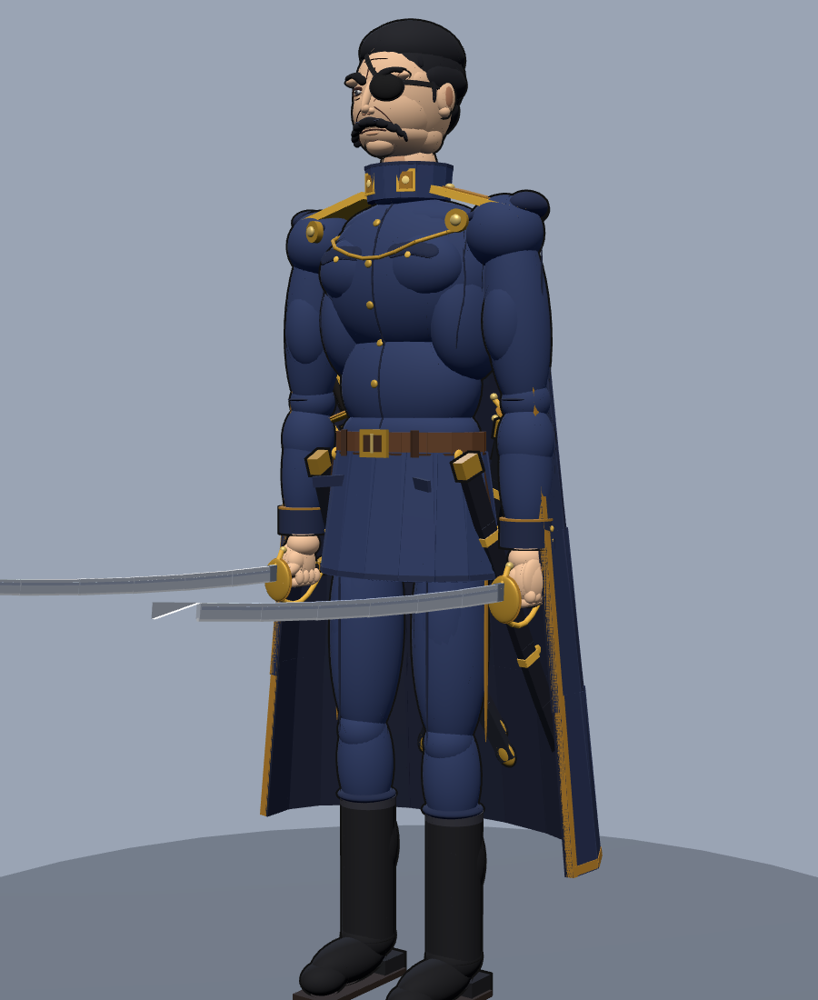
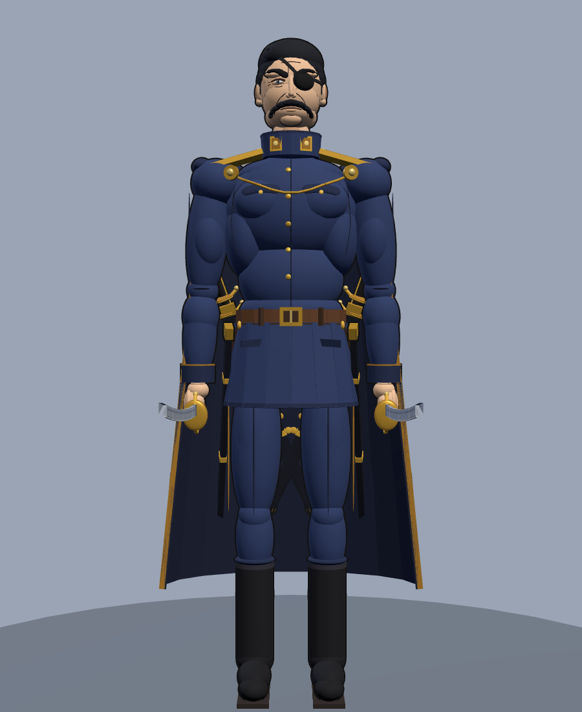
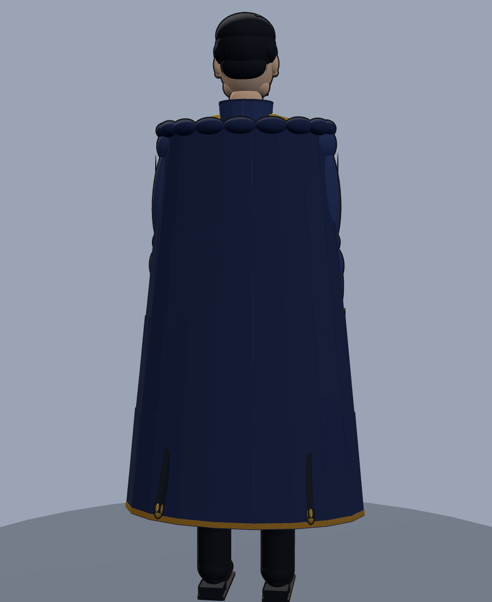
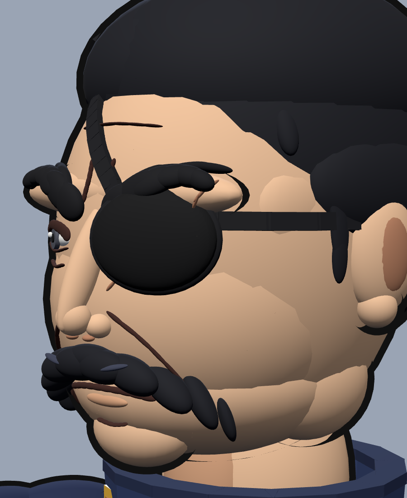
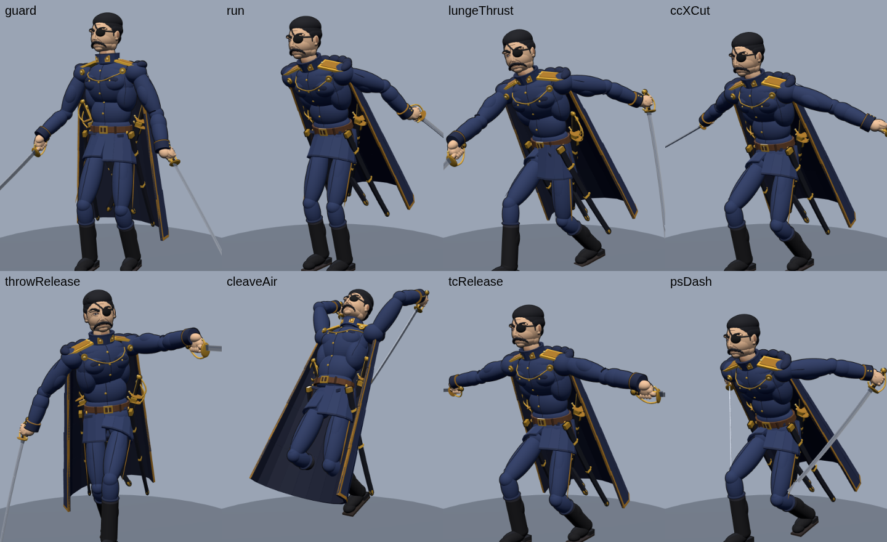

# King Bradley (Wrath) — Roblox boss

A drop-in boss fight for Roblox: Führer King Bradley from *Fullmetal Alchemist: Brotherhood*. It
follows the same structure as the Gluttony boss: one Model with a Config module, a server brain and
a client animator. It adds a shared `Motion` module (smooth dashes and leaps) and a `Poses` module
(the key poses).



| | | |
|---|---|---|
|  |  |  |

## Install

1. Open your place in Roblox Studio.
2. Right-click **Workspace → Insert from File…** and pick **`KingBradley.rbxmx`** (or drag the file
   into the Studio viewport).
3. Move the model to where the fight should happen. He needs solid ground under his feet. Rotate
   him to face where he should stand guard. That spot is his home: he returns there and resets
   when players flee past `LeashRange`.
4. Press Play. Nothing else is needed: no uploads, no plugins, no extra scripts.

Everything is built from Roblox primitives with built-in textures, so the file works in any place
without asset permissions. To make him bigger or smaller, use `Model:ScaleTo()` or the Scale tool;
every distance in the scripts follows the model scale.

## What's in the model

| Child | Type | Job |
|---|---|---|
| `Config` | ModuleScript | Every number of the fight: health, speeds, phase thresholds, cooldowns, damage, timings, sounds |
| `Motion` | ModuleScript | Scripted root paths, shared by server and client so dashes and leaps look smooth on every screen |
| `Poses` | ModuleScript | The 40-odd key poses the animations blend between (degrees and studs, easy to tweak) |
| `BossServer` | Script (Server) | Rig (Motor6Ds, welds, weapon hitboxes), AI, pathfinding, attacks, all damage, phases, death and respawn |
| `BossClient` | Script (Client) | All animation, cape cloth, arm and leg IK, VFX, camera shake, screen effects, knockback, anime outline, boss bar |

**Animations are procedural**, like Gluttony's. The client drives every Motor6D each frame from the
server's action attributes, so every player sees the same moment of the same cut. There is nothing
to upload to the animation editor.

## The model

* About 900 parts on a 25-bone rig, in the Führer's dress uniform: navy jacket with a standing
  collar, rank tabs, gold buttons, pocket flaps and seams; gold epaulettes with the stars; a brown
  sword belt with a brass buckle; a flared jacket skirt that opens with his stride; bloused trousers;
  tall polished boots.
* **Face**: square jaw, long straight nose, heavy brows pulled into a permanent frown, the thick
  black chevron mustache, slicked-back hair with a hard hairline, and anime ink lines (nasolabial
  folds, frown creases, crow's feet) drawn on the face surface. The visible right eye is narrowed
  into his glare.
* **Eyepatch** over the left eye, with its strap across the forehead and round the temple.
* **The Ultimate Eye** under the patch: a pale eye with the red **Ouroboros** mark (snake ring,
  hexagram, slit pupil), drawn with a SurfaceGui so it stays crisp. The eye starts with its lid
  closed and opens when he tears the patch off. Once open it glows and leaves a red light trail when
  he moves.
* **Sabers**: two drawn Amestris officer's sabers with gold shell guards, knuckle bows and
  wire-bound grips. Two scabbards hang on his hips and **four spare sabers** are crossed behind his
  hips, hidden by the cape until he throws it off.
* **Cape**: navy with a dark lining, gold trim and a gold chain across the chest. It is simulated
  as cloth: it flares when he runs and leaps, sways when he turns, and stays hanging straight down
  whatever his torso is doing.

## The fight

The design draws on what Bradley does in the anime: he fights with several sabers at once and
draws fresh ones from his belt, hurls them, cuts through tanks and the soldiers on them during the
Promised Day, and dodges or cuts gunfire. The Ultimate Eye lets him see and predict every movement
around him.

### Phase 1: the Führer (100% → 50%)
On first sight he **draws both sabers** (right hand to the left hip, left hand to the right hip,
then a flourish).

| Move | What happens |
|---|---|
| **Lunge** (Iaido dash) | Crouches with the right blade drawn back, then crosses up to 32 studs in a blink and cuts everyone on the line. Moving sideways during the wind-up dodges it. |
| **Cross Cut** | Right diagonal, left diagonal, then both blades in an **X**. He steps in with every cut. |
| **Saber Throw** | Hurls the left saber like a javelin (it sticks in the ground), then draws a spare from behind his hip. |
| **Tank Cleaver** | Leaps 14 studs high and splits the ground with both blades: an impact circle, a 30-stud fissure and knockback. Jump it to dodge. |

At **80%** he grabs the cape at the shoulder clasp, **rips it off and flings it away**. The cape
tumbles to the floor and the spare sabers come into view.

### Phase 2: the Ultimate Eye (50% → 0%)
He **tears off the eyepatch**. His head bows, the eye opens with a red pressure wave (knockback and
light damage), and a dark red aura rises off him. From then on:

* every basic attack plays **1.4x faster** with shorter cooldowns, and he sprints faster;
* attacks **lead their target**: the Lunge, Cleave and Saber Throw aim where you are going, not
  where you are;
* the outline smoulders red and the boss bar turns red with an **ULTIMATE EYE** tag;
* he unlocks two eye abilities:

| Ability | What happens |
|---|---|
| **Ultimate Eye: Thousand Cuts** | The eye locks on and the screen drains of colour with speed lines (time seems to stop). He then cuts **three times faster than normal**: 12 slashes in 1.5 s while advancing, leaving afterimages. It ends with both blades flung apart, releasing a **cross-shaped slash wave** that tears 80 studs down the arena. |
| **Ultimate Eye: Phantom Step** | A red reticle locks under one player and their screen tints. He reads their movement, then dashes a **pentagram of five cuts** through the spot they were heading for. The cuts **hang in the air, glowing**, while he stands with his back turned, then **all detonate at once**. Each line you stand in hurts, and the centre hurts most. Get out of the lines! |

### Death
He staggers, drops to one knee, lets his sabers fall, collapses onto his back looking at the sky,
then fades. He respawns after `RespawnTime` seconds. If everyone leaves, he walks home, heals, puts
his cape and eyepatch back on and sheathes his sabers.

## Animations

| Animation | Notes |
|---|---|
| Idle (out of combat) | At attention, hands clasped behind his back, sabers sheathed |
| Idle (combat) | Loose two-saber guard; the blades turn slightly while he breathes |
| Walk | Measured military walk with leg IK (feet plant on the ground) |
| Run | Hard forward lean with the blades trailing low; the cape flares |
| Draw / Sheathe | Hands reach the opposite hilts with arm IK |
| Remove Cape | Grabs the clasp, rips the cape off, flings it; the cape falls as cloth |
| Remove Eyepatch | Left hand to the patch, tears it off, flicks it away; the Ultimate Eye opens |
| Lunge, Cross Cut, Saber Throw, Tank Cleaver | The 4 basic attacks |
| Thousand Cuts, Phantom Step | The 2 Ultimate Eye abilities |
| Death | Stagger → kneel → falls on his back → fades |

Other details: blade trails, the eye's light trail, his head turning to watch you when you come
close, a flinch when hit, and a white hit-flash.



## Configuration (`Config`)

* `MaxHealth` (9000), `WalkSpeed`, `RunSpeed`, `EyeRunSpeed`, `RunDistance`.
* `CapeHealth` (0.8) and `EyeHealth` (0.5) are the phase thresholds. `EyeSpeedBoost` (1.4) and
  `EyeCooldownScale` (0.65) set how much faster phase 2 is.
* `AggroRange`, `LeashRange`, `BossBarRange`, `RespawnTime` (`nil` = no respawn).
* `Cooldowns.*` per move. `Actions.*` holds every timing, range and **damage** value (e.g.
  `Actions.PhantomStep.LineDamage`).
* `Sounds.*`: the defaults are sounds that ship with Roblox (`unsheath`, `swordslash`,
  `swordlunge`). Paste your own `rbxassetid://…` ids for impacts, the cape tear, the eye opening, a
  voice line, and so on. Empty entries are skipped.

Only player characters take damage, through `Humanoid:TakeDamage` (ForceFields work). Player
weapons can hit him: every body part gets an invisible hitbox that is a direct child of the model,
so `hit.Parent:FindFirstChildOfClass("Humanoid")` finds the boss.

## Rebuilding the model

The model is generated, so it can be tweaked and rebuilt:

```
python3 tools/build_model.py        # writes KingBradley.rbxmx with the scripts from src/
```

`tools/render_preview.mjs` renders the preview images and pose sheets in headless Chromium (see
the header of the file).
