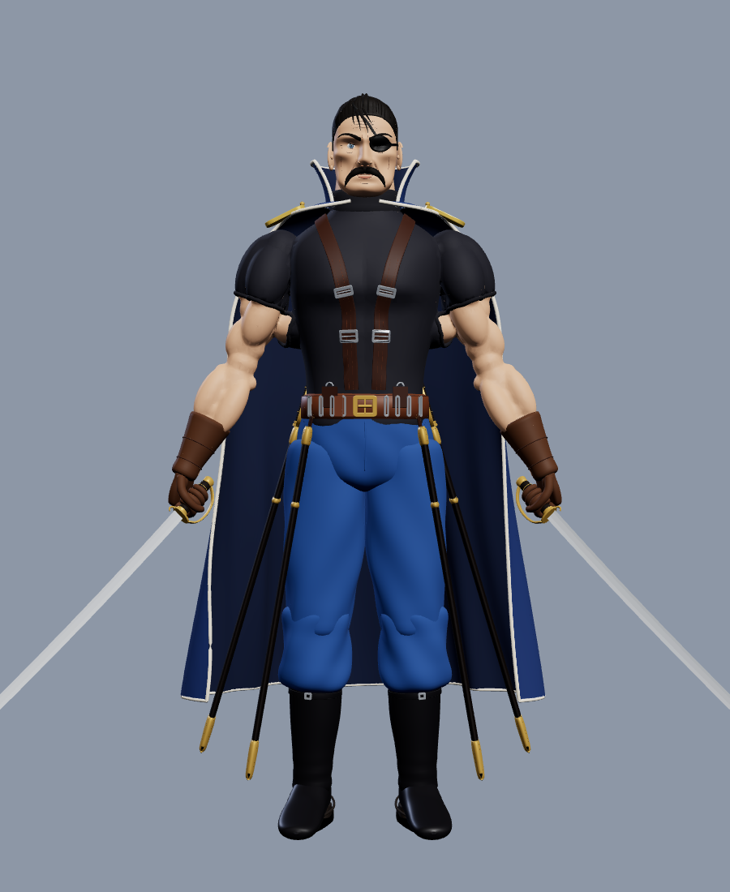
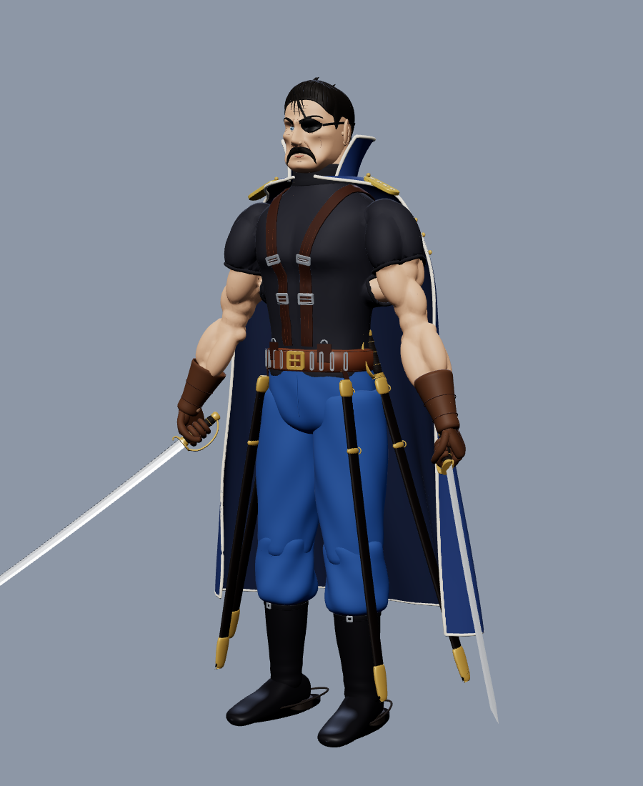
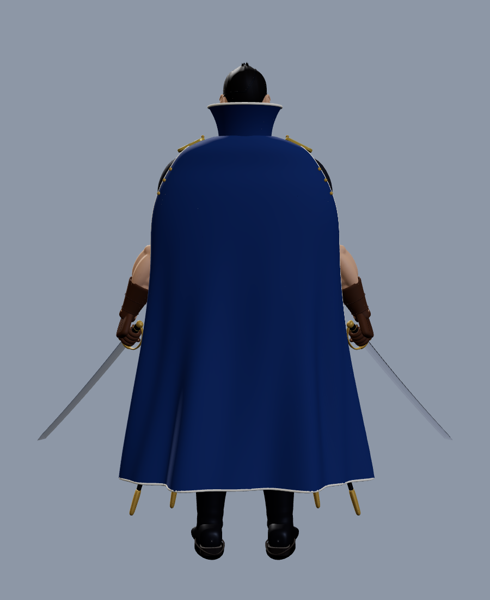
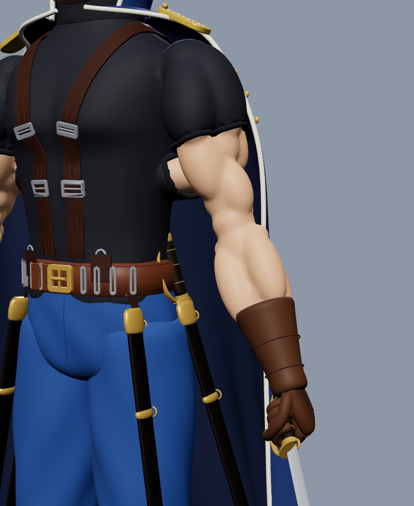
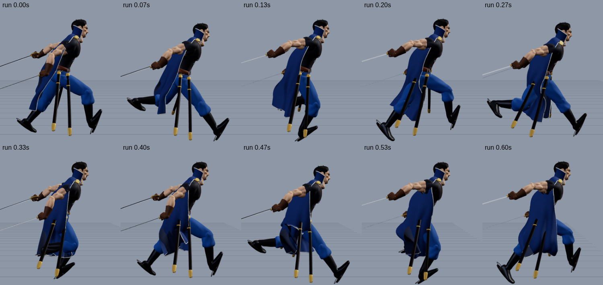
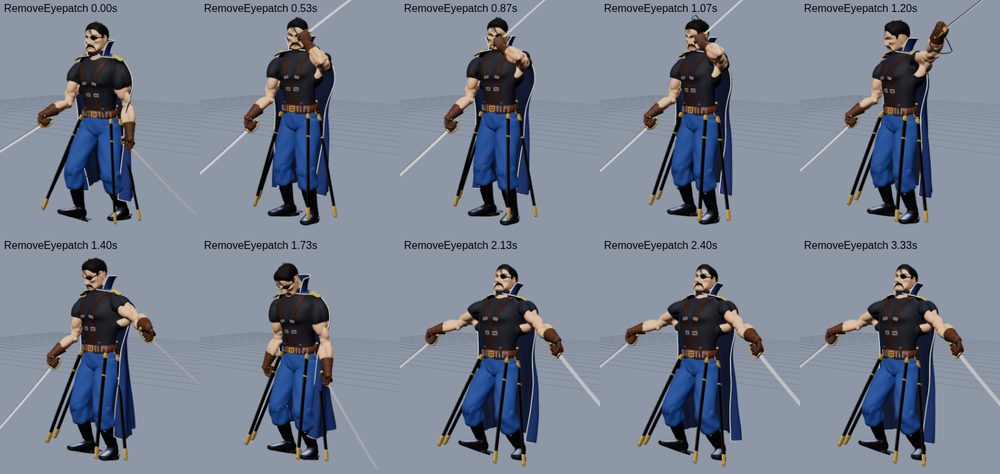
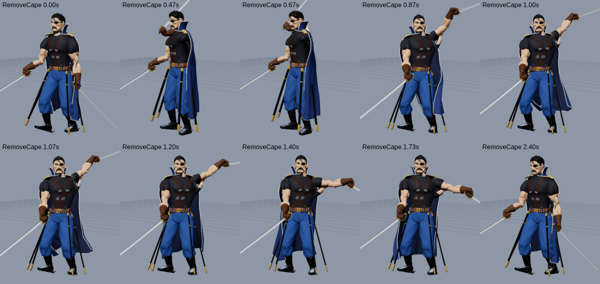
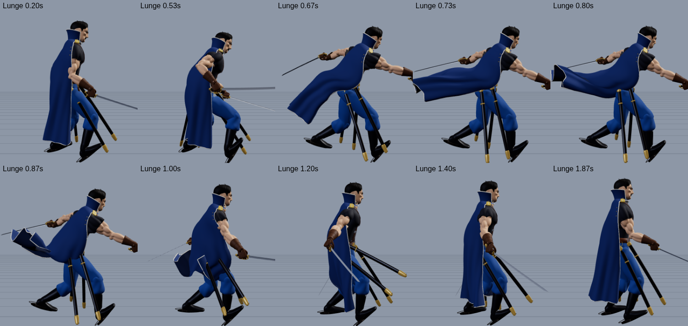
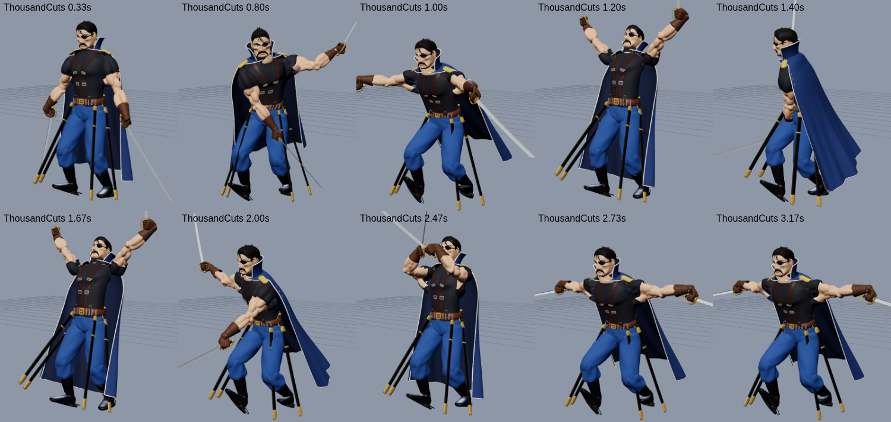

# King Bradley (Wrath): Roblox boss

A boss fight for Roblox featuring Führer King Bradley from *Fullmetal Alchemist: Brotherhood*. It
is structured like the Gluttony boss: one Model containing a Config module, a server brain and a
client animator. On top of that it adds:

* a shared `Motion` module for smooth dashes and leaps;
* a `Poses` module holding the key poses;
* an `Animator` engine that drives the bones of the skinned mesh.

The model is an improved version of the premade Bradley design:

* realistic, muscular shoulders and arms (deltoids, biceps, triceps, forearms) under the shirt;
* a properly fitted sleeve with a ribbed cuff;
* new skin tones;
* a full 49-bone skeleton with smooth skin weights, so the body bends like a person instead of
  rigid blocks.

| | | | |
|---|---|---|---|
|  |  |  |  |

## Files

| File | What it is |
|---|---|
| `model/KingBradley.fbx` | The rigged character: about 245k triangles in skinned MeshParts (each under the 20k-per-mesh limit, at most 4 bone influences per vertex) and a 49-bone armature. **Import this into Studio.** |
| `model/KingBradley.glb` | The same model as glTF, for Blender or other tools |
| `model/rig.json` | Bone list and rest positions (used by the offline test tools) |
| `KingBradleyScripts.rbxmx` | Folder with the 6 scripts: `Config`, `Motion`, `Poses`, `Animator`, `BossServer`, `BossClient` |

## Install

1. **Import the model.** In Roblox Studio, open **File → Import 3D** (or Avatar → Import 3D) and pick
   `model/KingBradley.fbx`.
   * Keep the rig/armature (bones) in the import. The import should give one Model with MeshParts
     and `Bone` objects such as `B_Hips`, `B_Chest`, `B_Cape3_2`.
   * Size does not matter: the server scales the model to `Config.TargetHeight` (9 studs) at
     start.
   * Name the model `KingBradley`.
2. **Insert the scripts.** Right-click **Workspace → Insert from File…** and pick
   `KingBradleyScripts.rbxmx`.
3. **Move the scripts into the model.** All 6 scripts must be **direct children of the model**.
   Drag them in, or run this in the command bar:
   ```lua
   local f = workspace.KingBradleyScripts; local m = workspace.KingBradley; for _, c in f:GetChildren() do c.Parent = m end; f:Destroy()
   ```
4. **Place him.** Put him where the fight should happen, standing on solid ground and facing where
   he should stand guard. That spot is his home: he returns there and resets when players flee past
   `LeashRange`.
5. **Press Play.**
   * The server anchors and scales the model and colours it from `Config.Colors`.
   * It builds the `HumanoidRootPart`, the `Humanoid` and the hitboxes, then welds everything
     together.
   * Nothing needs to be uploaded to the animation editor.

### Colours

Every mesh name ends with its material, for example `Body_Skin`, `Shirt_Shirt` or
`Cape_CoatBlue`. `Config.Colors` maps those names to `{ r, g, b, material?, reflectance? }`, so
skin, uniform, cape and steel can be retuned from one table without touching the meshes.

## The fight

The design draws on what Bradley does in the anime:

* he fights with several sabers at once and draws fresh ones from his belt;
* he hurls sabers;
* he cuts through tanks and the soldiers on them during the Promised Day;
* the Ultimate Eye lets him see and predict every movement around him.

### Phase 1: the Führer (100% → 50%)

On first sight he **levels a saber at your throat** (Challenge) while his cape stirs.

| Move | What happens |
|---|---|
| **Lunge** (iaido dash) | Crouches with the right blade drawn back, then crosses up to 32 studs in a blink and cuts everyone on the line |
| **Cross Cut** | Right diagonal, left diagonal, then both blades in an **X**. He steps in with every cut. |
| **Saber Throw** | Hurls the left saber like a javelin, then draws a spare |
| **Tank Cleaver** | Leaps high and splits the ground with both blades: an impact circle, a 30-stud fissure and knockback |

At **80% health** he takes off the cape:

1. His left hand grabs the cape at the right shoulder.
2. He **rips it off** and **flings it away**.
3. The cape keeps falling as cloth and lands crumpled.

### Phase 2: the Ultimate Eye (50% → 0%)

He **tears off the eyepatch**:

1. His left hand reaches up and grips the patch.
2. He tears it away and flicks it aside.
3. His head bows, then rises.
4. The Ouroboros eye opens with a red pressure wave and a light trail.

From then on:

* every basic attack plays **1.4× faster**, with shorter cooldowns;
* he sprints faster;
* he unlocks two eye abilities:

| Ability | What happens |
|---|---|
| **Thousand Cuts** | The eye locks on and time seems to stop. He then cuts **three times faster**: 12 slashes in 1.5 s while advancing, with afterimages. It ends in a **cross-shaped slash wave** that tears 80 studs down the arena. |
| **Phantom Step** | He reads where you are going and dashes a **pentagram of five cuts** through that spot. The cuts hang in the air while he stands with his back turned, then **all detonate at once**. Get out of the lines! |

### Death

1. He staggers and drops to one knee.
2. His sabers fall.
3. He collapses onto his back, looking at the sky, and fades.

He respawns after `RespawnTime` seconds.

## Animations

Every animation is procedural. Each frame, the client blends key poses and writes them into the
bones' `Transform`, driven by the server's action attributes, so every player sees the same moment
of the same cut.

On top of the key poses:

* **Overlapping action.** Hips lead; chest, shoulders, arms and head follow a few frames later.
  Moves wind up, overshoot and settle instead of snapping.
* **IK.** Two-bone IK keeps the feet planted, rolls the toes at push-off and puts the hands where
  they need to be: the cape clasp, the eyepatch, the spare saber.
* **Cape cloth.** The cape is a simulated cloth grid with collisions against the body and legs. It
  streams behind him on the run and swings when he turns.
* **Scabbards** swing on their straps and are pushed aside by the thighs.
* **Secondary motion.** Breathing, his head tracking the nearest player, and a flinch when hit.

| Animation | Notes |
|---|---|
| Idle | At ease out of combat; a loose two-saber guard in combat, with breathing and weight shifts |
| Walk / Run | Military walk; the run is a hard forward lean with blades trailing, cape streaming, scabbards swinging |
| Challenge | Points the saber at the target |
| Remove Cape | Grab at the shoulder, rip, fling; the cape falls as cloth |
| Remove Eyepatch | Reach, grip, tear, toss, bow; the eye opens |
| Lunge, Cross Cut, Saber Throw, Tank Cleaver | The 4 basic attacks |
| Thousand Cuts, Phantom Step | The 2 Ultimate Eye abilities |
| Death | Stagger → kneel → falls on his back → fades |







These sheets are rendered offline from the real `Animator` code running on the real rig (see
*Tools*).

## Configuration (`Config`)

* **Body and movement:** `TargetHeight`, `MaxHealth` (9000), `WalkSpeed`, `RunSpeed`,
  `EyeRunSpeed`.
* **Phases:** `CapeHealth` (0.8) and `EyeHealth` (0.5) are the phase thresholds. `EyeSpeedBoost`
  and `EyeCooldownScale` set how much faster phase 2 is.
* **Ranges and respawn:** `AggroRange`, `LeashRange`, `BossBarRange`, `RespawnTime`.
* **Moves:** `Cooldowns.*` per move. `Actions.*` holds every timing, range and damage value.
* **Sounds:** `Sounds.*`. The defaults ship with Roblox; paste your own `rbxassetid://…` ids and
  leave empty to skip.
* **Colours:** `Colors.*` (see above).

Damage and targeting:

* Only player characters take damage, through `Humanoid:TakeDamage`.
* Player weapons hit him through invisible hitboxes that are direct children of the model.

## Tools (rebuilding and testing)

| Tool | Job |
|---|---|
| `tools/blender/build_rig.py` | Blender 4.2 (bpy) script that turns the premade design GLB into the improved, rigged model. It sculpts the muscle shoulders and arms, refits the sleeves, builds the skeleton, skins it and exports `KingBradley.fbx/.glb` and `rig.json`. |
| `tools/build_scripts.py` | Packs `src/` into `KingBradleyScripts.rbxmx` |
| `tools/luau/make_harness.py` + `driver.luau` + `shim.luau` | Run the real `Animator` in the Luau CLI on the real rig and dump every bone per frame (also a NaN check) |
| `tools/anim_render.mjs` | Renders those frames on the skinned GLB in headless Chromium (three.js) as contact sheets |

## Not verifiable outside Studio

These parts were built to Roblox's documented behaviour but could not be run here:

* the exact hierarchy Studio's importer produces;
* `Model:ScaleTo` on the bones;
* client-side `Bone.Transform`.

If something looks wrong after import, look for the `[Bradley]` warnings in the output window
first. A model imported without its bones, for example, reports `no B_Hips bone found`.
